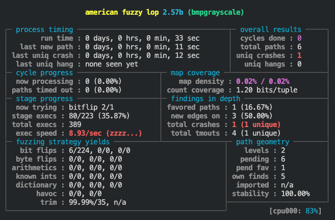
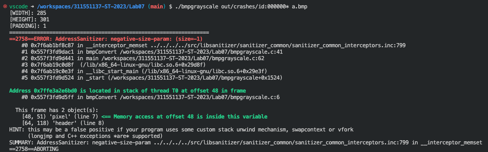

## PoC: the file that can trigger the vulnerability

[Click Here](./out/crashes/)

## The commands (steps) that you used in this lab

In a new Ubuntu 22.04 docker container, run the following commands:

``` sh
cd Lab07
sudo git clone https://github.com/google/AFL.git
cd AFL
make
sudo make install
cd ..
export CC=~/../../workspaces/311551137-ST-2023/Lab07/AFL/afl-gcc
export AFL_USE_ASAN=1
make
mkdir in
cp test.bmp in/
./AFL/afl-fuzz -i in -o out -m none -- ./bmpgrayscale @@ a.bmp
# ctrl + C
./bmpgrayscale out/crashes/id:000000* a.bmp
```

## Screenshot of AFL running (with triggered crash)




## Screenshot of crash detail (with ASAN error report)

